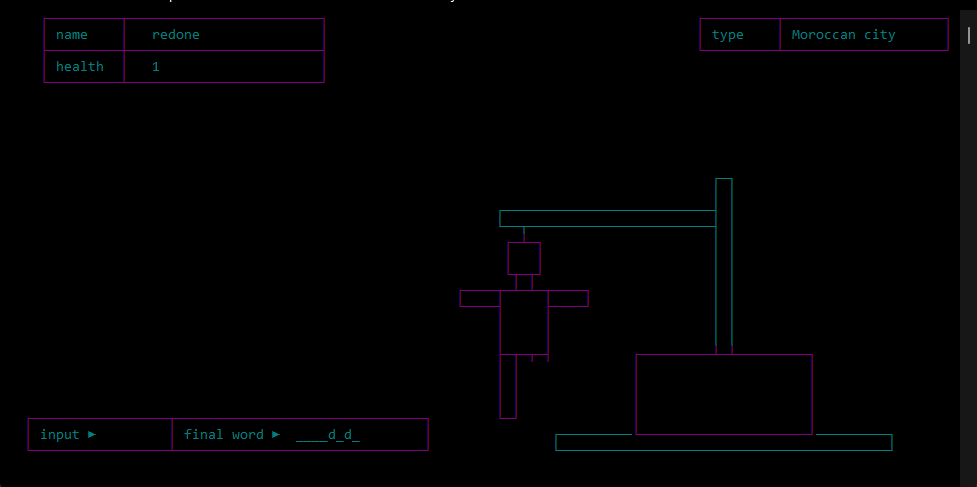
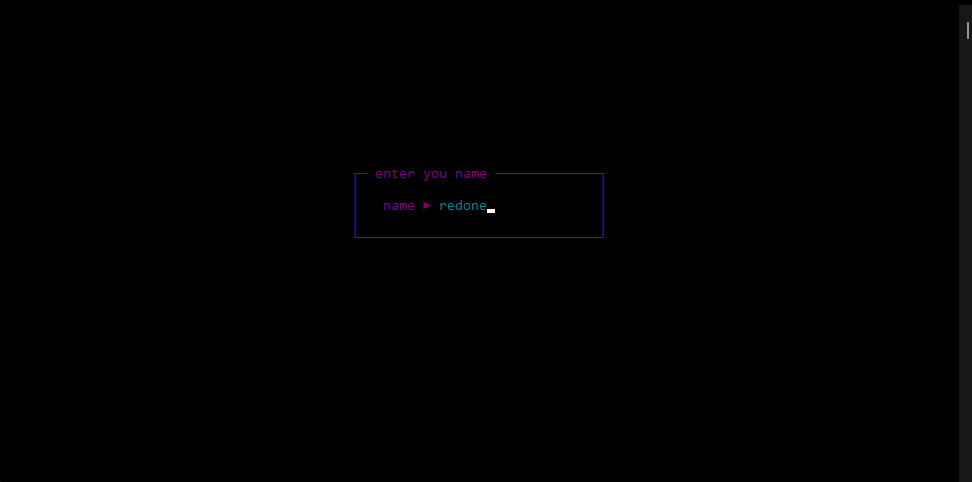

# RCONIO
a small TUI library based on conio for windows and linux

## How to use
just copy rconio.c and rconio.h to you project and include them

## examples

## functions

- gotoxy(int x, int y)                  : changing the current cursor coordinates on the screen
- ***************************************************************************************
- textcolor( <int | COLORS> color)      : changing the text color.
- bgcolor(<int | COLORS> color)         : changing the text background color.
    - ps: you can see the available colors for every plafrom in rconio.h file.
- ***************************************************************************************
- printxy(int x, int y, arguments...)                 : printing in a specific location in the screen.
- c_printxy(COLORS color, int x, int y, arguments...) : printing with colors in a specific location in the screen.
- ***************************************************************************************
- clrscr() : clearing the entire screen.
- getch()  : getting input from the user.
- ***************************************************************************************
- get_terminal_infos(int* witdth, int *height)  : give you the the width and the height of the curr terminal.
    - ps: you can make the function return all the terminal information you just need to make it return entire infos struct.
